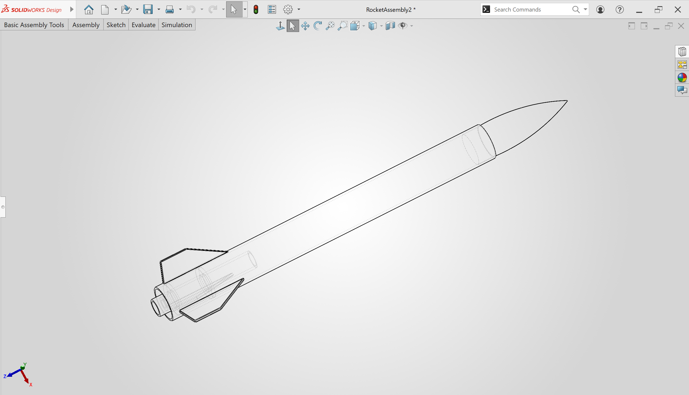
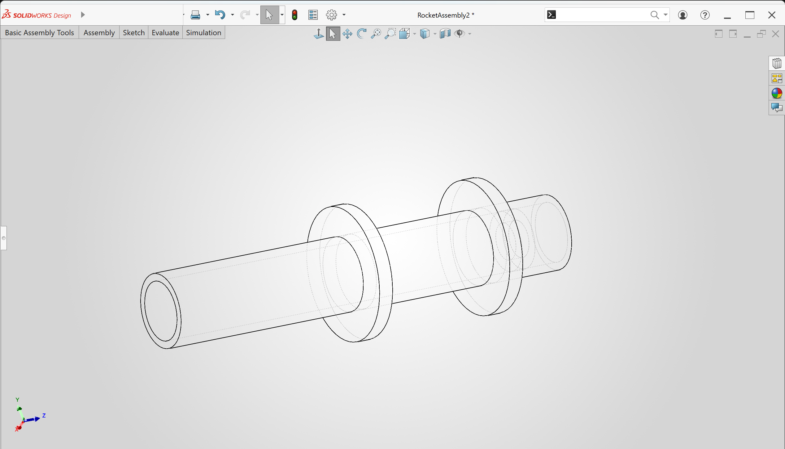

# rocket-cad-design
# Rocket Design (SolidWorks CAD)

## Overview
Designed a multi-part model rocket assembly in SolidWorks, focusing on both external structure and internal components used in real-world rocket construction.

## Key Features
- Full rocket assembly including nose cone, body tube, and fins
- Internal motor mount system with centering rings
- Symmetrical fin placement using circular pattern
- Emphasis on structural alignment and realistic design

## Tools Used
- SolidWorks (CAD)

## Design Insight
This project focuses on how individual components integrate into a complete rocket system. Internal structures such as centering rings and motor mounts were included to reflect real engineering design considerations.

## Preview

### Full Rocket View

### Isometric View

### Internal Structure

